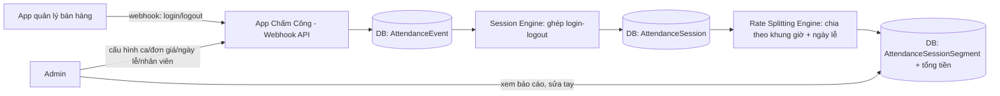
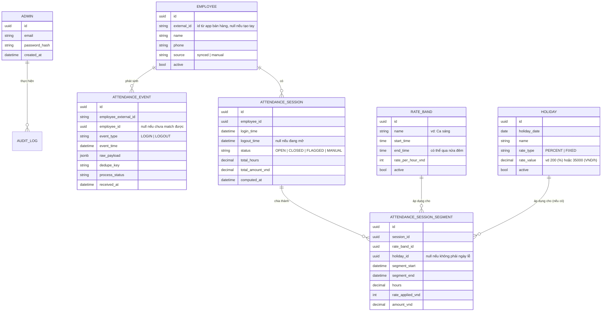

# PRD: Hệ thống Chấm công & Tính lương Partime tự động ("App Chấm Công")

Tài liệu này dùng để đưa cho Claude Code (hoặc bất kỳ agent lập trình nào) thực hiện từng task một. Mỗi task được thiết kế đủ nhỏ để làm và test độc lập, có thể copy nguyên phần mô tả của 1 task vào 1 phiên làm việc riêng.

---

## 0. Tổng quan sản phẩm

**Bài toán:** Hộ kinh doanh nhỏ có nhân viên partime. Nhân viên chấm công gián tiếp thông qua việc **login/logout vào app quản lý bán hàng** đang dùng hàng ngày (không cần app chấm công riêng cho nhân viên thao tác). App quản lý bán hàng bắn **webhook** báo sự kiện login/logout sang app Chấm Công. App Chấm Công có nhiệm vụ:

1. Ghi nhận thời điểm vào ca (login) và ra ca (logout) của từng nhân viên.
2. Tự tính số giờ làm giữa login → logout.
3. Tự tính tiền công dựa trên đơn giá theo khung giờ trong ngày (vì lương partime tính theo giờ, đơn giá khác nhau theo khung giờ), có tính đến ngày lễ (đơn giá khác/hệ số khác).
4. Cho phép **nhiều Admin** (chủ hộ kinh doanh, quản lý) đăng nhập để cấu hình khung giờ/đơn giá/ngày lễ, quản lý nhân viên, xem/sửa dữ liệu chấm công và xem báo cáo lương.

**Người dùng:** Chỉ có 1 loại tài khoản là **Admin** (không có tài khoản nhân viên trong app này). Nhân viên không tương tác trực tiếp với app Chấm Công.

**Nguồn nhân viên:** Đồng bộ từ app quản lý bán hàng (qua webhook hoặc field trong payload), hoặc Admin tự tạo tay trong app Chấm Công.

### Luồng tổng quan



---

## 1. Giả định & Quyết định thiết kế (cần xác nhận trước khi code)

Vì đề bài chưa chốt hết chi tiết kỹ thuật, tài liệu này đưa ra các giả định hợp lý bên dưới. Đọc kỹ trước khi giao task đầu tiên cho Claude Code — nếu có giả định nào sai với thực tế, sửa lại trong tài liệu trước khi code, vì nhiều task sau phụ thuộc vào các quyết định này.

1. **Tech stack: JavaScript (chốt, không cần cân nhắc thêm).** Backend: Node.js + Express (hoặc Fastify) + PostgreSQL + Prisma (ORM/migration). Frontend admin: React (Vite) gọi REST API của backend. Toàn bộ code (backend + frontend) đều là JavaScript (có thể dùng TypeScript nếu Claude Code thấy hợp lý hơn cho một dự án nhiều module, nhưng mặc định là JS thuần). Task T0 chỉ cần dựng khung theo đúng lựa chọn này, không cần chọn lại stack khác.
2. **Có giao diện web cho Admin** (không chỉ API thuần), vì người dùng là chủ hộ kinh doanh, cần thao tác trực quan (tạo ca, sửa ngày lễ, xem chấm công).
3. **Webhook từ app bán hàng:** giả định payload dạng JSON, có tối thiểu: mã nhân viên (external_id), tên nhân viên, loại sự kiện (login/logout), thời điểm sự kiện (timestamp có timezone). **Xác thực webhook (HMAC/token/…) sẽ làm SAU, không làm ở giai đoạn đầu** — endpoint `POST /webhooks/attendance` ở task T6 tạm thời **nhận request không cần xác thực** (chấp nhận mọi request đúng schema payload). Việc bổ sung xác thực đầy đủ được tách riêng thành task T17 (làm ở cuối, sau khi các luồng chính đã chạy ổn), lúc đó mới quyết định cơ chế cụ thể tuỳ khả năng thực tế của app bán hàng.
4. **Múi giờ:** toàn bộ hệ thống dùng giờ Việt Nam (Asia/Ho_Chi_Minh, UTC+7). Timestamp lưu DB dạng UTC, hiển thị/so sánh khung giờ luôn convert về giờ VN.
5. **Ngày lễ Việt Nam có ngày âm lịch (Tết Nguyên Đán) thay đổi mỗi năm** → hệ thống KHÔNG tự tính lịch âm, mà để Admin tự nhập/sửa ngày lễ cụ thể theo dương lịch mỗi năm (đúng như yêu cầu "admin có thể chỉnh sửa ngày lễ"). Có thể seed sẵn danh sách ngày lễ dương lịch cố định (Tết Dương lịch 1/1, Giỗ Tổ, 30/4, 1/5, Quốc khánh 2/9) làm ví dụ, còn Tết Âm lịch để Admin tự thêm hàng năm.
6. **Ngày lễ áp dụng theo ngày dương lịch cụ thể, cho toàn bộ 24h của ngày đó**, không phân biệt khung giờ — tức là nếu 12/2/2026 là ngày lễ thì mọi khung giờ làm việc trong ngày 12/2/2026 đều được áp hệ số/đơn giá ngày lễ (áp trên nền đơn giá của khung giờ tương ứng, xem thuật toán ở Task T9).
7. **Khung giờ tính giá (Rate Band / "ca")** do Admin tự định nghĩa. Ví dụ chuẩn dùng xuyên suốt tài liệu này (đã chốt, phủ kín đủ 24h, không còn khoảng trống): **Ca 1: 06:00–17:00** (khung 6:00–9:00 được gộp chung vào ca này, tính cùng đơn giá — theo yêu cầu chủ hộ kinh doanh, không tách riêng), **Ca 2: 17:00–24:00**, **Ca 3: 00:00–06:00**. Hệ thống KHÔNG bắt buộc nhân viên chọn ca khi chấm công — hệ thống tự xác định giờ làm thực tế rơi vào (các) khung giờ nào để tính tiền. Admin vẫn có thể tự do sửa/tạo thêm khung giờ khác sau này; hệ thống phải validate **không chồng lấn** và **cảnh báo nếu có khoảng trống chưa phủ kín 24h** (xem T4) — tính năng cảnh báo gap vẫn giữ để phòng trường hợp Admin cấu hình lại sau này, dù với bộ 3 ca mặc định ở trên thì không có gap.
8. **Ngưỡng phiên chấm công bất thường:** nếu 1 phiên (session) mở quá N giờ liên tục chưa có logout (mặc định đề xuất N = 16 giờ, Admin có thể chỉnh), hệ thống tự động đánh dấu `flagged` để Admin xử lý tay, KHÔNG tự tính tiền cho tới khi Admin xác nhận/sửa giờ ra.
9. **Không có tính năng chấm công tay từ đầu (không qua webhook)** cho luồng chính, nhưng Admin cần có khả năng **sửa tay** 1 phiên chấm công đã ghi nhận (sửa giờ vào/ra) để xử lý các trường hợp lỗi webhook, quên chấm công.
10. **Không giới hạn 1 địa điểm/cửa hàng** ở phiên bản đầu (single-tenant, 1 hộ kinh doanh = 1 hệ thống). Nếu sau này cần nhiều chi nhánh, để ngỏ mở rộng (ghi chú trong data model) nhưng không làm ở phase này.

> Nếu bạn (chủ hộ kinh doanh) muốn thay đổi giả định nào ở trên, sửa trực tiếp trong file này trước khi đưa cho Claude Code, để các task phía dưới luôn nhất quán.

---

## 2. Mô hình dữ liệu tham chiếu (Data Model)

Tất cả các task bên dưới tham chiếu tới các entity này. Đây là schema mức khái niệm — task T1 sẽ hiện thực hoá thành bảng DB thật.



---

## 3. Cách đọc mỗi Task bên dưới

Mỗi task gồm các mục cố định:

- **Mục tiêu:** task này để làm gì, giá trị mang lại.
- **Phụ thuộc:** task nào phải xong trước.
- **Phạm vi (In scope) / Ngoài phạm vi (Out of scope):** để tránh làm lan man.
- **Yêu cầu chức năng:** danh sách yêu cầu cụ thể, đánh số.
- **Entity/API liên quan:** bảng dữ liệu và endpoint gợi ý.
- **Acceptance Criteria (Definition of Done):** điều kiện để coi task hoàn thành.
- **Test cases bắt buộc:** liệt kê case cần viết test (unit/integration), kể cả edge case.

---

## PHASE 0 — Nền tảng

### T0. Khởi tạo project & môi trường

**Mục tiêu:** Có bộ khung project chạy được, có CI đơn giản, có DB kết nối được, có endpoint healthcheck.

**Phụ thuộc:** Không có.

**Phạm vi:**
1. Dựng khung project theo stack đã chốt (JavaScript): backend Node.js + Express (hoặc Fastify) + Prisma, frontend React (Vite). Ghi vào README các version cụ thể đã dùng.
2. Cấu trúc thư mục project (backend/, frontend/ hoặc mono-repo, vd dùng npm workspaces).
3. Cấu hình biến môi trường (.env.example): DB connection string, PORT, JWT secret, `WEBHOOK_SECRET` (khai báo sẵn cho T17 dùng sau, chưa cần dùng ở các task hiện tại).
4. Endpoint `GET /health` trả `200 OK` kèm version, thời gian server, kết nối DB thành công hay không.
5. Docker Compose để chạy local (app + PostgreSQL).
6. Thiết lập test runner Jest (hoặc Vitest) cho cả backend và frontend, chạy được `npm test` với ít nhất 1 test mẫu pass.

**Ngoài phạm vi:** business logic, schema thật (sẽ ở T1).

**Acceptance Criteria:**
- `docker compose up` chạy được, `/health` trả 200 và `db_connected: true`.
- Có file README mô tả cách chạy local, chạy test, chạy migration.
- Pipeline test mẫu chạy xanh.

**Test cases bắt buộc:**
- Test `/health` trả đúng status 200 khi DB kết nối OK.
- Test `/health` trả trạng thái lỗi rõ ràng (không crash) khi DB không kết nối được (mock/giả lập mất kết nối).

---

### T1. Thiết kế & migration schema dữ liệu

**Mục tiêu:** Hiện thực hoá toàn bộ data model ở mục 2 thành bảng DB thật kèm migration, có seed script.

**Phụ thuộc:** T0.

**Phạm vi:**
1. Tạo migration cho các bảng: `admins`, `employees`, `rate_bands`, `holidays`, `attendance_events`, `attendance_sessions`, `attendance_session_segments`, `audit_logs`, `webhook_logs`.
2. Định nghĩa khóa ngoại, index cần thiết: index theo `employee_id`, `event_time`, `dedupe_key` (unique), `holiday_date` (unique), index `(employee_id, status)` trên `attendance_sessions` để tìm nhanh session đang mở.
3. Ràng buộc dữ liệu: `dedupe_key` unique trên `attendance_events`; `holiday_date` unique trên `holidays`; `attendance_sessions.status` là enum.
4. Seed script tạo: 1 admin mặc định (từ biến môi trường hoặc random password in ra log lần đầu); 3 rate band mẫu theo đúng ví dụ đã chốt — Ca 1 (06:00–17:00, 23.000đ/h), Ca 2 (17:00–24:00, 23.000đ/h), Ca 3 (00:00–06:00, 23.000đ/h) — phủ kín 24h, không gap; vài ngày lễ dương lịch cố định mẫu (1/1, 30/4, 1/5, 2/9), 1-2 employee mẫu.

**Entity/API liên quan:** toàn bộ entity ở mục 2.

**Acceptance Criteria:**
- Chạy migration từ DB rỗng thành công, rollback được (down migration).
- Seed script chạy xong tạo đủ dữ liệu mẫu, chạy lại lần 2 không bị lỗi trùng khóa (idempotent hoặc có cảnh báo rõ).
- Có tài liệu ERD (có thể export từ mermaid ở mục 2 hoặc từ tool) trong repo.

**Test cases bắt buộc:**
- Test migration up/down không lỗi trên DB test sạch.
- Test constraint unique `dedupe_key` (insert trùng phải bị chặn).
- Test constraint unique `holiday_date` (insert 2 ngày lễ cùng ngày phải lỗi hoặc bị chặn ở tầng service).
- Test seed script chạy xong đúng số lượng bản ghi kỳ vọng.

---

## PHASE 1 — Admin & Quản lý nhân viên

### T2. Xác thực Admin (đăng nhập, quản lý nhiều Admin)

**Mục tiêu:** Cho phép nhiều tài khoản Admin đăng nhập an toàn, quản lý (thêm/xoá/đổi mật khẩu) lẫn nhau.

**Phụ thuộc:** T1.

**Phạm vi:**
1. `POST /auth/login` — đăng nhập bằng email + password, trả JWT (hoặc session cookie).
2. `POST /auth/logout`.
3. `POST /admins` — Admin đang đăng nhập tạo thêm Admin mới (email, password, name).
4. `GET /admins`, `DELETE /admins/:id` (không cho tự xoá chính mình nếu là admin cuối cùng).
5. `PATCH /admins/:id/password` — đổi mật khẩu.
6. Middleware xác thực JWT cho toàn bộ API admin phía sau (endpoint webhook ở T6 KHÔNG dùng middleware này — webhook tạm thời không xác thực, xem Giả định #3, sẽ có cơ chế riêng ở T17).
7. Mật khẩu hash bằng bcrypt/argon2, không lưu plaintext.
8. Rate limit đăng nhập sai (vd khoá tạm 5 phút sau 5 lần sai) để chống brute-force.

**Ngoài phạm vi:** phân quyền chi tiết theo role (chỉ có 1 loại role "admin" ở phase này), quên mật khẩu qua email (có thể để task sau nếu cần).

**Acceptance Criteria:**
- Đăng nhập đúng → nhận token hợp lệ; sai → 401, không lộ thông tin email có tồn tại hay không.
- Không thể xoá Admin cuối cùng trong hệ thống (luôn phải còn ≥1 admin).
- Toàn bộ endpoint quản lý (trừ webhook) trả 401 nếu thiếu/token sai.

**Test cases bắt buộc:**
- Login thành công với đúng email/password.
- Login thất bại với sai password → 401.
- Gọi API cần auth mà không có token → 401.
- Tạo admin mới thành công, admin mới login được ngay.
- Xoá admin khi chỉ còn 1 admin → bị chặn, trả lỗi rõ ràng.
- Rate limit: sau N lần login sai liên tiếp, lần thứ N+1 bị chặn dù đúng password.
- Đổi mật khẩu thành công, token cũ (nếu là session-based) hoặc password cũ không còn dùng được để login.

---

### T3. Quản lý Nhân viên (Employee CRUD)

**Mục tiêu:** Admin quản lý danh sách nhân viên: xem nhân viên đồng bộ từ app bán hàng, tạo/sửa/vô hiệu hoá nhân viên thủ công.

**Phụ thuộc:** T1, T2.

**Phạm vi:**
1. `GET /employees` — list, filter theo `source` (synced/manual), `active`, tìm theo tên.
2. `POST /employees` — tạo nhân viên thủ công (name, phone; `external_id = null`, `source = manual`).
3. `PATCH /employees/:id` — sửa tên, phone, trạng thái active.
4. `DELETE /employees/:id` — thực chất là soft-delete (set `active = false`), không xoá cứng vì còn liên kết dữ liệu chấm công lịch sử.
5. Logic **match/merge**: nếu 1 `external_id` từ webhook trùng với nhân viên tạo tay trước đó (Admin gán thủ công `external_id` cho nhân viên manual để "nối" 2 nguồn) → `PATCH /employees/:id/link-external` gán `external_id`.
6. Validate: `external_id` unique trong hệ thống (nếu có).

**Entity/API liên quan:** `employees`.

**Acceptance Criteria:**
- CRUD hoạt động đầy đủ, soft-delete không mất dữ liệu chấm công liên quan.
- Không thể tạo 2 nhân viên có cùng `external_id`.
- Gán `external_id` cho nhân viên manual thành công, sau đó webhook với `external_id` đó match đúng nhân viên này (liên kết chặt với T7).

**Test cases bắt buộc:**
- Tạo nhân viên manual thành công, `source = manual`, `external_id = null`.
- Tạo nhân viên với `external_id` trùng nhân viên đã có → lỗi 409.
- Vô hiệu hoá nhân viên (soft-delete) → nhân viên biến mất khỏi danh sách active nhưng dữ liệu session cũ vẫn truy vấn được.
- Gán `external_id` cho nhân viên manual thành công; gán trùng `external_id` đã dùng cho nhân viên khác → lỗi.
- Filter theo `source`, theo `active`, tìm theo tên trả đúng kết quả.

---

## PHASE 2 — Cấu hình Khung giờ & Ngày lễ

### T4. Quản lý Khung giờ tính giá (Rate Band / "Ca")

**Mục tiêu:** Admin định nghĩa các khung giờ trong ngày kèm đơn giá/giờ, hệ thống đảm bảo khung giờ hợp lệ (không chồng lấn, có thể cảnh báo nếu chưa phủ kín 24h).

**Phụ thuộc:** T1, T2.

**Phạm vi:**
1. `GET /rate-bands`, `POST /rate-bands` (name, start_time, end_time, rate_per_hour_vnd), `PATCH /rate-bands/:id`, `DELETE /rate-bands/:id` (soft-delete nếu đã có segment lịch sử tham chiếu, hard-delete nếu chưa dùng).
2. Hỗ trợ khung giờ **qua nửa đêm** (vd `start_time=00:00, end_time=06:00` hoặc biểu diễn dạng `22:00 → 06:00` tuỳ convention đã chọn — ghi rõ convention trong code/README).
3. **Validation chồng lấn:** khi tạo/sửa 1 rate band active, hệ thống kiểm tra không được chồng giờ với rate band active khác. Trả lỗi rõ đoạn giờ bị trùng.
4. **Cảnh báo (không chặn) nếu tổng các khung giờ active chưa phủ kín 24 giờ** — trả về danh sách khoảng trống (gap) để Admin biết, vì giờ rơi vào gap sẽ không tính được tiền (xem xử lý ở T9).
5. `GET /rate-bands/coverage` — endpoint trả về bản đồ phủ 24h (band nào áp dụng khung nào, khoảng trống nào).

**Entity/API liên quan:** `rate_bands`.

**Acceptance Criteria:**
- Tạo band chồng giờ với band khác đang active → bị chặn, lỗi nêu rõ khung giờ xung đột.
- Tạo band qua nửa đêm (vd 22:00–06:00) hoạt động đúng, không bị coi là lỗi input.
- Endpoint coverage trả đúng danh sách gap khi có.
- Sửa/xoá band đã có dữ liệu chấm công tham chiếu → không xoá cứng, chỉ set inactive; band cũ vẫn hiển thị đúng trong lịch sử chấm công.

**Test cases bắt buộc:**
- Tạo 3 band mặc định 06:00–17:00, 17:00–24:00, 00:00–06:00 → không chồng lấn, thành công.
- Tạo thêm band 16:00–18:00 (chồng với 06:00-17:00 và 17:00-24:00) → lỗi.
- Tạo band qua nửa đêm 00:00–06:00 → thành công, tính đúng là 6 tiếng.
- Coverage: với 3 band mặc định 06-17, 17-24, 00-06 → phủ kín 24h, trả `gaps: []`.
- Coverage: giả lập Admin tự sửa lại band 1 thành 09:00–17:00 (thu hẹp lại, tạo khoảng trống) → trả đúng gap 06:00–09:00, minh hoạ tính năng cảnh báo gap hoạt động khi cấu hình bị thu hẹp.
- Xoá band đã có `attendance_session_segment` tham chiếu → soft-delete, dữ liệu segment cũ vẫn còn nguyên giá trị `rate_applied_vnd` đã chốt tại thời điểm tính.

---

### T5. Quản lý Ngày lễ (Holiday)

**Mục tiêu:** Admin thêm/sửa/xoá ngày lễ cụ thể theo năm, chọn kiểu tính (theo % hay giá cố định/giờ).

**Phụ thuộc:** T1, T2.

**Phạm vi:**
1. `GET /holidays` (filter theo năm), `POST /holidays` (holiday_date, name, rate_type: PERCENT|FIXED, rate_value), `PATCH /holidays/:id`, `DELETE /holidays/:id`.
2. Validate: mỗi `holiday_date` chỉ có 1 bản ghi active (không cho 2 ngày lễ trùng ngày).
3. `rate_type = PERCENT`: `rate_value` là % áp lên đơn giá của rate band tương ứng tại khung giờ đó (vd 200 nghĩa là gấp đôi đơn giá band).
4. `rate_type = FIXED`: `rate_value` là đơn giá/giờ cố định (VND), **ghi đè hoàn toàn** đơn giá của rate band trong ngày đó, bất kể band nào.
5. Seed sẵn vài ngày lễ dương lịch cố định (xem T1); ghi rõ trong tài liệu vận hành rằng Admin cần tự thêm Tết Âm lịch và các ngày nghỉ do công ty quyết định mỗi năm.
6. `GET /holidays/:date` — kiểm tra nhanh 1 ngày có phải lễ không (dùng nội bộ bởi rate engine T9, có thể là hàm service, không nhất thiết expose API).

**Entity/API liên quan:** `holidays`.

**Acceptance Criteria:**
- CRUD hoạt động đầy đủ; không tạo được 2 ngày lễ trùng `holiday_date`.
- Sửa ngày lễ đã áp dụng cho các session cũ **không** thay đổi số tiền đã chốt của session cũ (số liệu lịch sử giữ nguyên - xem thêm T11 về recompute có chủ đích).
- Có thể tạo ngày lễ tương lai trước, hệ thống tự áp dụng khi tới ngày đó.

**Test cases bắt buộc:**
- Tạo ngày lễ PERCENT=200 cho ngày X → session rơi đúng ngày X được nhân đôi đơn giá band tương ứng (test tích hợp với T9).
- Tạo ngày lễ FIXED=50000 cho ngày Y → mọi giờ làm trong ngày Y tính đúng 50,000đ/giờ bất kể band nào.
- Tạo trùng `holiday_date` → lỗi 409.
- Xoá/deactivate ngày lễ → session tính TRƯỚC thời điểm xoá vẫn giữ nguyên số liệu lịch sử; session tính SAU thời điểm xoá không còn áp dụng ưu đãi lễ.

---

## PHASE 3 — Nhận dữ liệu chấm công (Webhook & Session)

### T6. Webhook nhận sự kiện chấm công

**Mục tiêu:** Nhận sự kiện login/logout từ app quản lý bán hàng một cách an toàn, đáng tin cậy, có audit log.

**Phụ thuộc:** T1.

**Phạm vi:**
1. `POST /webhooks/attendance` — nhận payload JSON (định dạng đề xuất, cần khớp thực tế app bán hàng):
   ```json
   {
     "employee_external_id": "EMP001",
     "employee_name": "Nguyen Van A",
     "event_type": "LOGIN",
     "event_time": "2026-08-30T09:02:15+07:00",
     "event_id": "evt_abc123"
   }
   ```
2. **Xác thực: CHƯA làm ở task này** (đã chốt trong mục Giả định #3) — endpoint tạm thời nhận mọi request đúng schema payload, không kiểm tra chữ ký/token. Chỉ cần để sẵn 1 chỗ trống rõ ràng trong code (vd 1 middleware no-op `verifyWebhookAuth()` chưa làm gì) để task T17 sau này cắm xác thực thật vào mà không phải sửa lại luồng chính.
3. Idempotency: tính `dedupe_key` = `event_id` nếu có, hoặc hash(`employee_external_id` + `event_type` + `event_time`) nếu không có `event_id`. Nếu `dedupe_key` đã tồn tại → trả 200 (chấp nhận, không xử lý lại), không tạo bản ghi trùng.
4. Lưu mọi request (kể cả lỗi xác thực, lỗi parse) vào `webhook_logs` để debug (raw body, headers liên quan, kết quả xử lý, timestamp).
5. Lưu bản ghi hợp lệ vào `attendance_events` với `process_status = PENDING`, sau đó gọi sang module xử lý session (T7, T8) — có thể xử lý đồng bộ trong cùng request nếu nhanh, hoặc queue nếu cần (ghi rõ lựa chọn).
6. Trả response nhanh (< 1s): `200` nếu nhận thành công (kể cả khi xử lý nghiệp vụ sau đó gặp warning — warning không được làm webhook trả lỗi để tránh app bán hàng retry loạn), `400` nếu payload thiếu field bắt buộc.

**Entity/API liên quan:** `attendance_events`, `webhook_logs`.

**Acceptance Criteria:**
- Request payload hợp lệ (bất kể có header xác thực hay không) → 200, tạo đúng 1 `attendance_event`.
- Gửi trùng `event_id` 2 lần → chỉ có 1 `attendance_event`, lần 2 vẫn trả 200.
- Payload thiếu `event_type` hoặc `event_time` → 400, log lại lỗi.

**Test cases bắt buộc:**
- Webhook payload hợp lệ, không kèm header xác thực nào → 200 + event được lưu (đúng như đã chốt: auth làm sau).
- Webhook gửi trùng `event_id` → idempotent, không tạo 2 bản ghi.
- Webhook thiếu `event_time` → 400.
- Webhook với `event_type` không hợp lệ (không phải LOGIN/LOGOUT) → 400.
- Webhook payload rất lớn/field lạ thừa → hệ thống bỏ qua field thừa, không crash.
- Test hiệu năng đơn giản: 100 request liên tiếp không làm timeout endpoint.

---

### T7. Khớp nhân viên (Employee Matching/Resolution)

**Mục tiêu:** Từ `employee_external_id` trong sự kiện webhook, xác định đúng `Employee` trong hệ thống; tự tạo mới nếu cấu hình cho phép.

**Phụ thuộc:** T3, T6.

**Phạm vi:**
1. Khi xử lý `attendance_event`: tìm `Employee` có `external_id` khớp.
2. Nếu **không tìm thấy** và cấu hình `AUTO_CREATE_EMPLOYEE_ON_WEBHOOK = true` (mặc định true, Admin chỉnh trong Settings) → tự tạo `Employee` mới với `source = synced`, `name = employee_name` từ payload, `active = true`.
3. Nếu **không tìm thấy** và cấu hình `= false` → đánh dấu `attendance_event.process_status = UNMATCHED`, không tạo session, sinh cảnh báo để Admin thấy trong dashboard (danh sách "sự kiện chưa khớp nhân viên") và có thể xử lý tay: tạo employee mới, hoặc link vào employee manual có sẵn (dùng API `link-external` ở T3), sau đó **replay** lại các event UNMATCHED liên quan tới `external_id` đó.
4. `GET /attendance-events/unmatched` — liệt kê sự kiện chưa khớp.
5. `POST /attendance-events/:id/reprocess` — xử lý lại 1 event sau khi Admin đã link nhân viên.

**Entity/API liên quan:** `employees`, `attendance_events`.

**Acceptance Criteria:**
- Event với `external_id` đã tồn tại → match đúng employee ngay.
- Event với `external_id` mới, auto-create bật → tạo employee mới `source=synced` và xử lý tiếp session bình thường.
- Event với `external_id` mới, auto-create tắt → vào danh sách unmatched, không tạo session.
- Sau khi Admin link employee thủ công và reprocess → event được xử lý, session được tạo/nối đúng.

**Test cases bắt buộc:**
- Auto-create bật: webhook login với external_id chưa từng thấy → employee mới được tạo, session mở tương ứng.
- Auto-create tắt: webhook login với external_id chưa từng thấy → event ở trạng thái UNMATCHED, xuất hiện trong `GET /attendance-events/unmatched`.
- Link external_id cho employee manual có sẵn rồi reprocess event UNMATCHED cũ → event xử lý thành công, gắn đúng employee đã link.
- Employee đã bị `active=false` (vô hiệu hoá) nhưng vẫn còn webhook gửi tới → event vẫn được ghi nhận nhưng có cảnh báo "nhân viên không còn hoạt động" (quyết định nghiệp vụ: vẫn tính công hay từ chối — mặc định: vẫn ghi nhận + cảnh báo, Admin xử lý tay).

---

### T8. Vòng đời phiên chấm công (Attendance Session Lifecycle)

**Mục tiêu:** Ghép cặp sự kiện LOGIN/LOGOUT thành `AttendanceSession`, xử lý các trường hợp bất thường (mất login/mất logout, chồng phiên).

**Phụ thuộc:** T7.

**Phạm vi:**
1. Xử lý `event_type=LOGIN`:
   - Nếu employee **chưa có session nào đang OPEN** → tạo `AttendanceSession` mới `status=OPEN`, `login_time = event_time`.
   - Nếu employee **đã có 1 session đang OPEN** (thiếu logout trước đó) → coi là bất thường: tự động đóng session cũ với `status=FLAGGED` (không tự tính tiền, chờ Admin xác nhận giờ ra), rồi mở session mới cho login hiện tại. Ghi log rõ lý do flag: "missing logout, auto-closed by next login".
2. Xử lý `event_type=LOGOUT`:
   - Nếu employee có session đang OPEN → đóng session: `logout_time = event_time`, `status=CLOSED`, trigger tính toán (T9).
   - Nếu **không có** session OPEN nào (logout mồ côi, có thể do mất event login) → tạo 1 `AttendanceSession` với `status=FLAGGED`, `login_time=null`, `logout_time=event_time`, để Admin bổ sung giờ vào tay.
3. **Ngưỡng tự động flag phiên treo quá lâu:** job định kỳ (cron, vd chạy mỗi giờ) quét các session `OPEN` có `now - login_time > N giờ` (N cấu hình được, mặc định 16) → set `status=FLAGGED`.
4. Toàn bộ chuyển trạng thái phải ghi vào `audit_logs` hoặc field lịch sử để truy vết.
5. `GET /attendance-sessions?status=FLAGGED` — danh sách phiên cần Admin xử lý tay.

**Entity/API liên quan:** `attendance_sessions`, `attendance_events`.

**Acceptance Criteria:**
- Login → Logout bình thường → 1 session `CLOSED` với đúng giờ vào/ra.
- Login → Login (không có logout ở giữa) → session cũ bị `FLAGGED`, session mới `OPEN`.
- Logout mồ côi (không có login mở) → tạo session `FLAGGED` với `login_time=null`.
- Session mở quá ngưỡng N giờ → job cron tự chuyển sang `FLAGGED`.

**Test cases bắt buộc:**
- LOGIN rồi LOGOUT cùng ngày → session CLOSED, giờ đúng.
- LOGIN, LOGIN (employee quên logout) → session 1 chuyển FLAGGED, session 2 là OPEN mới.
- LOGOUT không có LOGIN trước → tạo session FLAGGED, `login_time=null`, không tính tiền cho tới khi Admin bổ sung.
- Session OPEN từ 20 giờ trước (giả lập bằng cách chỉnh `login_time` trong test), chạy job quét → session chuyển FLAGGED.
- Hai nhân viên khác nhau login/logout xen kẽ nhau → mỗi người có session riêng, không lẫn lộn.
- LOGOUT đến đúng lúc job cron cũng đang flag phiên đó (race condition) → không bị lỗi dữ liệu (test bằng transaction/lock, đảm bảo 1 trong 2 thắng nhất quán).

---

## PHASE 4 — Tính công & tiền lương

### T9. Rate Splitting Engine (thuật toán chia giờ & tính tiền) — CORE LOGIC

**Mục tiêu:** Từ 1 session đã CLOSED (có login_time, logout_time), chia thành các đoạn (`AttendanceSessionSegment`) theo (a) ranh giới ngày dương lịch, (b) ranh giới khung giờ (rate band), (c) áp dụng ngày lễ nếu có, và tính tổng giờ + tổng tiền.

**Phụ thuộc:** T4, T5, T8.

**Thuật toán đề xuất (bắt buộc theo đúng thứ tự để đảm bảo nhất quán):**
1. Chia khoảng `[login_time, logout_time)` thành các đoạn con theo **ranh giới nửa đêm** (00:00 giờ VN) trước — mỗi đoạn con nằm trọn trong 1 ngày dương lịch.
2. Với mỗi đoạn con trong 1 ngày: tiếp tục chia theo **ranh giới các rate band active** phủ trong ngày đó (band có thể qua nửa đêm nhưng vì đã chia theo ngày ở bước 1 nên trong phạm vi 1 ngày band coi như khoảng giờ bình thường trong `[00:00, 24:00)`).
3. Với mỗi đoạn kết quả (đã nằm trọn trong 1 ngày và 1 band): kiểm tra ngày đó có phải `Holiday` active không (T5).
   - Không phải lễ → `rate_applied = rate_band.rate_per_hour_vnd`.
   - Là lễ, `rate_type=PERCENT` → `rate_applied = rate_band.rate_per_hour_vnd * rate_value / 100`.
   - Là lễ, `rate_type=FIXED` → `rate_applied = holiday.rate_value` (bỏ qua rate band).
4. Đoạn thời gian **rơi vào gap** (không có rate band nào phủ, xem T4 coverage) → vẫn tạo segment nhưng đánh dấu `rate_band_id=null`, `rate_applied=0` (hoặc dùng mức lương tối thiểu mặc định nếu Admin cấu hình — ghi rõ lựa chọn trong code) và tạo cảnh báo hiển thị cho Admin ("có X phút không tính được đơn giá, vui lòng bổ sung khung giờ").
5. `hours` mỗi segment tính bằng phút chính xác chia 60 (làm tròn tới 2 chữ số thập phân, KHÔNG làm tròn xuống theo giờ nguyên — vì tính theo giờ chính xác cho partime).
6. `amount = hours * rate_applied` (làm tròn tiền VND tới đơn vị đồng).
7. Tổng `AttendanceSession.total_hours = sum(segment.hours)`, `total_amount_vnd = sum(segment.amount_vnd)`.
8. Toàn bộ tính toán phải là **hàm thuần (pure function)** nhận input `(login_time, logout_time, list rate_bands active tại thời điểm đó, list holidays active tại thời điểm đó)` và trả ra list segment — để test độc lập không cần DB thật (dễ viết unit test).

**Entity/API liên quan:** `attendance_sessions`, `attendance_session_segments`, `rate_bands`, `holidays`.

**Acceptance Criteria:**
- Session gói gọn trong 1 band, không phải lễ → 1 segment duy nhất, tiền = giờ × đơn giá band.
- Session vắt qua nhiều band trong cùng ngày → nhiều segment, tổng giờ = tổng thời lượng session.
- Session vắt qua nửa đêm (qua 2 ngày dương lịch) → segment tách đúng tại mốc 00:00, mỗi phần tính theo band + trạng thái lễ của ngày tương ứng.
- Session có 1 phần rơi vào ngày lễ, 1 phần không → chỉ phần rơi vào ngày lễ được áp hệ số/giá lễ.
- Tổng tiền tất cả segment cộng lại đúng bằng `total_amount_vnd` của session, sai số làm tròn ở mức chấp nhận được (≤ 1đ mỗi segment do làm tròn).

**Test cases bắt buộc (unit test, dùng ví dụ cụ thể đã chốt: 23.000đ/h cho cả 3 band 06:00–17:00, 17:00–24:00, 00:00–06:00 — phủ kín 24h, không gap):**
- Login 09:00, logout 17:00 (ngày thường) → 1 segment, 8 giờ, 8 × 23.000 = 184.000đ.
- Login 07:00, logout 10:00 (ngày thường) → chỉ 1 segment duy nhất 07:00–10:00 (3h, band 1: 06:00–17:00), KHÔNG bị tách tại mốc 09:00 — đúng yêu cầu "khung 6h-9h tính như ca 9-17" vì giờ đây 6h-9h nằm trong cùng 1 band với 9-17.
- Login 15:00, logout 19:00 (ngày thường) → 2 segment: 15:00-17:00 (2h, band 1) + 17:00-19:00 (2h, band 2), tổng 4h.
- Login 22:00, logout 02:00 hôm sau (ngày thường, cả 2 ngày không lễ) → segment 22:00-24:00 (band 2, ngày A) + 00:00-02:00 (band 3, ngày B) — vì 22:00 nằm trong band 17:00-24:00.
- Login 23:00 ngày lễ (PERCENT 200%), logout 01:00 ngày thường hôm sau → segment 23:00-24:00 áp giá gấp đôi (band 2 × 200%), segment 00:00-01:00 áp giá thường (band 3, không nhân vì ngày hôm sau không lễ).
- Login/logout trọn trong ngày lễ FIXED=50.000đ/h, vắt qua 2 band khác nhau → cả 2 segment đều dùng rate 50.000đ/h bất kể band gốc là gì.
- Session dài đúng bằng 1 phút (test làm tròn số lẻ) → tính đúng theo phút, không làm tròn về 0 hoặc 1 giờ.
- Giả lập Admin thu hẹp band 1 lại thành 09:00–17:00 (tạo gap 06:00–09:00, xem T4) rồi cho session login 07:00 → segment phần 07:00–09:00 rơi vào gap, tạo ra với `rate_applied=0` và có cờ cảnh báo, KHÔNG làm crash hay bỏ sót giờ khỏi `total_hours` — test này chỉ để đảm bảo engine không vỡ khi gặp cấu hình có gap, không phải hành vi mặc định.
- So sánh: cùng input chạy hàm 2 lần → kết quả giống hệt nhau (đảm bảo tính thuần/deterministic).

---

### T10. Trigger tính toán khi session đóng & khi cấu hình thay đổi

**Mục tiêu:** Nối module T9 vào vòng đời thực tế: session đóng thì tự tính ngay; đồng thời quyết định rõ việc gì xảy ra khi Admin sửa rate band/holiday **sau khi** đã có session tính rồi (mặc định: KHÔNG tự động tính lại session cũ, chỉ áp dụng cho session tính từ giờ trở đi — giữ nguyên số liệu lịch sử, trừ khi Admin chủ động bấm "tính lại" ở T11).

**Phụ thuộc:** T9.

**Phạm vi:**
1. Khi `AttendanceSession` chuyển sang `CLOSED` (từ T8) → gọi rate splitting engine (T9) ngay, lưu segment, cập nhật `total_hours`, `total_amount_vnd`, `computed_at`.
2. Snapshot: mỗi `AttendanceSessionSegment` lưu **giá trị `rate_applied_vnd` đã chốt tại thời điểm tính**, không tham chiếu động tới `rate_bands`/`holidays` nữa — đảm bảo sửa cấu hình sau này không âm thầm đổi số liệu lịch sử.
3. Xử lý lỗi: nếu tính toán gặp lỗi (vd rate band bị xoá giữa chừng) → session giữ `status=CLOSED` nhưng thêm cờ `computation_error`, hiển thị cảnh báo cho Admin, không để hệ thống crash toàn cục.

**Acceptance Criteria:**
- Mọi session `CLOSED` đều có segment và tổng tiền ngay sau khi đóng (đồng bộ, không cần chờ job riêng — trừ khi thiết kế bất đồng bộ thì phải có cơ chế đảm bảo tính xong trong vài giây và trạng thái "đang tính" hiển thị rõ).
- Sửa rate band sau khi session A đã tính xong → số tiền của session A không đổi khi query lại.

**Test cases bắt buộc:**
- Đóng session → segment + tổng tiền xuất hiện ngay trong response/DB.
- Sửa đơn giá rate band từ 23.000 → 30.000, sau đó query lại session đã tính trước đó → vẫn ra số cũ (23.000).
- Giả lập lỗi (xoá rate band đang được tham chiếu ngay trong lúc tính) → session không tính được nhưng hệ thống không crash, có cờ lỗi rõ ràng, Admin thấy được trong danh sách cần xử lý.

---

### T11. Sửa tay phiên chấm công & tính lại có chủ đích (Manual Correction & Recompute)

**Mục tiêu:** Cho Admin sửa giờ vào/ra của 1 session (kể cả session FLAGGED do thiếu login/logout), hoặc chủ động yêu cầu tính lại 1 session theo cấu hình rate/holiday hiện tại.

**Phụ thuộc:** T9, T10.

**Phạm vi:**
1. `PATCH /attendance-sessions/:id` — Admin sửa `login_time`, `logout_time` (bắt buộc nếu đang null do FLAGGED), có thể set `status=MANUAL` sau khi sửa. Validate: `logout_time > login_time`, không cho tạo chồng lấn với session khác cùng nhân viên.
2. Sau khi sửa, tự động trigger tính lại (gọi T9) cho session đó, ghi đè segment cũ.
3. `POST /attendance-sessions/:id/recompute` — tính lại session theo config rate/holiday **hiện tại** (dùng khi Admin cố ý muốn cập nhật số liệu cũ theo giá mới, thao tác này phải yêu cầu xác nhận rõ ràng vì làm thay đổi số liệu lịch sử).
4. Mọi thay đổi tay đều ghi `audit_logs`: ai sửa, sửa gì, giá trị trước/sau, thời điểm.

**Acceptance Criteria:**
- Sửa giờ vào/ra của session FLAGGED (thiếu login) → session tính lại đúng, chuyển `status=MANUAL` hoặc `CLOSED` tuỳ quy ước đã chọn.
- Audit log ghi đầy đủ, xem lại được lịch sử sửa của 1 session.
- Recompute chủ đích cập nhật đúng số liệu mới, có cảnh báo/xác nhận trước khi thực hiện.

**Test cases bắt buộc:**
- Sửa `login_time` của session FLAGGED (đang null) → tính lại đúng số giờ/tiền mới.
- Sửa giờ khiến `logout_time <= login_time` → bị chặn, trả lỗi validate.
- Sửa giờ khiến session chồng lấn với session khác của cùng nhân viên → bị chặn.
- Recompute 1 session cũ sau khi đơn giá đã đổi → số tiền cập nhật theo đơn giá mới, audit log ghi rõ số cũ/số mới.
- Kiểm tra quyền: chỉ Admin đã đăng nhập mới gọi được các API này.

---

## PHASE 5 — Giao diện Admin

### T12. Đăng nhập & Dashboard tổng quan

**Mục tiêu:** Trang đăng nhập Admin + màn hình tổng quan: ai đang chấm công (session OPEN), tổng hợp nhanh hôm nay, danh sách cần xử lý (FLAGGED, UNMATCHED).

**Phụ thuộc:** T2, T7, T8.

**Phạm vi:**
1. Trang login (form email/password, gọi API T2).
2. Dashboard hiển thị: số nhân viên đang trong ca (session OPEN) kèm giờ vào; tổng số phiên FLAGGED cần xử lý; tổng số event UNMATCHED cần xử lý; tổng chi phí lương tạm tính hôm nay.
3. Điều hướng sang các trang quản lý khác (nhân viên, ca, ngày lễ, chấm công, báo cáo).

**Acceptance Criteria:**
- Đăng nhập sai hiển thị lỗi rõ ràng, không crash.
- Dashboard load đúng số liệu khớp với dữ liệu seed/test.
- Responsive tối thiểu (dùng được trên màn hình laptop phổ biến).

**Test cases bắt buộc:**
- Đăng nhập đúng → chuyển vào dashboard.
- Đăng nhập sai → hiện thông báo lỗi, ở lại trang login.
- Dashboard hiển thị đúng số session OPEN khi có N nhân viên đang chấm công (test bằng dữ liệu giả lập).
- Dashboard hiển thị đúng số lượng FLAGGED/UNMATCHED và bấm vào điều hướng đúng trang chi tiết.

---

### T13. Giao diện quản lý Nhân viên

**Mục tiêu:** UI CRUD nhân viên tương ứng API T3.

**Phụ thuộc:** T3, T12.

**Phạm vi:** danh sách nhân viên (kèm badge nguồn synced/manual, trạng thái active), form tạo/sửa, thao tác vô hiệu hoá, thao tác "link external_id".

**Acceptance Criteria:** thao tác trên UI phản ánh đúng qua API, có thông báo thành công/lỗi rõ ràng.

**Test cases bắt buộc:**
- Tạo nhân viên qua form → xuất hiện trong danh sách ngay.
- Sửa tên nhân viên → cập nhật hiển thị ngay không cần reload thủ công.
- Vô hiệu hoá nhân viên → biến khỏi filter "đang hoạt động" nhưng còn trong filter "tất cả".
- Thao tác link external_id thành công hiển thị rõ nhân viên đã "đã đồng bộ".

---

### T14. Giao diện quản lý Khung giờ & Ngày lễ

**Mục tiêu:** UI CRUD cho rate band (T4) và holiday (T5), có hiển thị trực quan bản đồ phủ 24h và cảnh báo gap/chồng lấn.

**Phụ thuộc:** T4, T5, T12.

**Phạm vi:**
1. Trang Rate Band: danh sách, form thêm/sửa, **biểu đồ timeline 24h** trực quan hoá các band (màu khác nhau), hiển thị rõ đoạn gap (nếu có) bằng màu cảnh báo.
2. Trang Holiday: danh sách theo năm, form thêm/sửa (chọn PERCENT hay FIXED), lịch mini highlight các ngày lễ đã cấu hình.

**Acceptance Criteria:**
- Tạo band chồng giờ → UI hiển thị lỗi từ API rõ ràng, không cho lưu.
- Timeline hiển thị đúng theo dữ liệu band hiện có, cập nhật ngay khi thêm/sửa.
- Thêm ngày lễ mới → xuất hiện đúng vị trí trên lịch mini.

**Test cases bắt buộc:**
- Thêm band hợp lệ → hiển thị đúng trên timeline.
- Thêm band chồng giờ → form hiển thị lỗi, band không được thêm vào danh sách.
- Thêm ngày lễ trùng ngày đã có → hiển thị lỗi từ API.
- Xoá ngày lễ → biến mất khỏi lịch mini ngay.

---

### T15. Giao diện xem & xử lý Chấm công

**Mục tiêu:** UI cho Admin xem lịch sử chấm công theo nhân viên/theo ngày, xem breakdown tính tiền chi tiết theo segment, xử lý các phiên FLAGGED/UNMATCHED.

**Phụ thuộc:** T8, T9, T11, T12.

**Phạm vi:**
1. Danh sách session (filter theo nhân viên, khoảng ngày, status).
2. Xem chi tiết 1 session: login/logout, danh sách segment (khung giờ, có phải lễ không, đơn giá áp dụng, số tiền), tổng giờ, tổng tiền.
3. Màn hình riêng cho "Cần xử lý": danh sách FLAGGED (thiếu giờ vào/ra) và UNMATCHED (chưa khớp nhân viên), có action sửa/link ngay tại chỗ.
4. Form sửa giờ vào/ra gọi API T11, hiển thị lại số tiền tính lại ngay sau khi sửa (preview trước khi lưu là điểm cộng, không bắt buộc).

**Acceptance Criteria:**
- Breakdown segment hiển thị đúng khớp dữ liệu backend (đối chiếu với test case ở T9).
- Xử lý xong 1 phiên FLAGGED → phiên đó biến mất khỏi danh sách "cần xử lý", xuất hiện trong lịch sử với số liệu đúng.

**Test cases bắt buộc:**
- Xem chi tiết session có nhiều segment → hiển thị đúng thứ tự thời gian, đúng số tiền từng đoạn và tổng.
- Từ màn "cần xử lý", sửa giờ vào cho 1 phiên FLAGGED và lưu → phiên chuyển trạng thái, số tiền hiển thị đúng ngay.
- Filter theo nhân viên + khoảng ngày trả đúng danh sách.
- Link nhân viên cho 1 event UNMATCHED ngay từ UI → event được xử lý, phiên tương ứng xuất hiện.

---

## PHASE 6 — Báo cáo

### T16. Báo cáo & xuất dữ liệu lương

**Mục tiêu:** Tổng hợp chi phí lương theo nhân viên theo kỳ (ngày/tuần/tháng tuỳ chọn khoảng ngày), xuất file CSV/Excel để đối chiếu trả lương.

**Phụ thuộc:** T9, T12.

**Phạm vi:**
1. `GET /reports/payroll?from=...&to=...&employee_id=(optional)` — trả tổng giờ, tổng tiền theo từng nhân viên trong khoảng ngày, kèm số phiên đã tính vs số phiên còn FLAGGED (để Admin biết báo cáo có thể chưa đầy đủ nếu còn phiên chưa xử lý).
2. UI trang báo cáo: chọn khoảng ngày, xem bảng tổng hợp theo nhân viên, nút "Xuất Excel/CSV".
3. File xuất gồm: tên nhân viên, tổng giờ, tổng tiền, số phiên, và (tuỳ chọn) chi tiết từng phiên ở sheet/tab phụ.
4. Cảnh báo rõ trên báo cáo nếu khoảng ngày được chọn còn tồn tại session FLAGGED/UNMATCHED chưa xử lý (số liệu có thể thiếu).

**Acceptance Criteria:**
- Số liệu báo cáo khớp chính xác với tổng các session CLOSED trong khoảng ngày được chọn.
- File xuất mở được bằng Excel/Google Sheets, dữ liệu đúng định dạng số tiền VND.

**Test cases bắt buộc:**
- Báo cáo cho 1 nhân viên có 3 session trong kỳ → tổng đúng bằng tổng 3 session.
- Báo cáo có session FLAGGED trong kỳ → hiển thị cảnh báo, không tính nhầm session đó vào tổng.
- Xuất CSV/Excel → mở lại đọc đúng số liệu, đúng encoding (không lỗi font tiếng Việt).
- Báo cáo với khoảng ngày rỗng dữ liệu → trả về bảng trống, không lỗi.

---

## PHASE 7 — Vận hành & Kiểm thử tổng thể

### T17. Xác thực & độ tin cậy Webhook (làm sau, khi đã sẵn sàng chốt cơ chế với app bán hàng)

**Mục tiêu:** Đây là task **bổ sung xác thực thật** cho endpoint webhook (T6 cố tình để tạm không xác thực — xem Giả định #3). Ngoài ra củng cố endpoint đạt mức sẵn sàng vận hành thật: chống trùng lặp, chống tấn công, retry an toàn. **Không cần làm ngay** — chỉ làm khi đã biết rõ app quản lý bán hàng hỗ trợ cơ chế xác thực gì (hoặc quyết định không cần vì mạng nội bộ/IP tĩnh).

**Phụ thuộc:** T6.

**Phạm vi:**
1. Cắm xác thực thật vào middleware `verifyWebhookAuth()` (chỗ trống đã để sẵn ở T6): tối thiểu 1 trong 2 — header `X-Webhook-Signature` (HMAC-SHA256 của body với secret) hoặc header `X-Webhook-Token` cố định, chọn qua biến môi trường. Request sai xác thực → `401`, vẫn ghi log vào `webhook_logs` (đánh dấu lý do từ chối), KHÔNG tạo `attendance_event`.
2. Rate limiting theo IP/nguồn cho endpoint webhook (chống spam/DDoS đơn giản).
3. Logging có thể tra cứu theo `event_id`/`employee_external_id` để debug khi có khiếu nại "chấm công sai giờ".
4. Xác nhận lại cơ chế xác thực (HMAC hay token) khớp với khả năng thực tế của app quản lý bán hàng — nếu app đó **không hỗ trợ ký HMAC**, tài liệu hoá rõ phương án thay thế (token bí mật trong URL/header, whitelist IP nếu có).
5. Xử lý retry từ phía app bán hàng (nếu app đó tự động gửi lại khi timeout) — đảm bảo idempotency (đã có ở T6) đủ để không tính trùng.

**Acceptance Criteria:** endpoint yêu cầu xác thực đúng mới xử lý, chịu được thử tải nhẹ (vài trăm request/phút) không lỗi, có thể trace lại toàn bộ vòng đời 1 event từ log.

**Test cases bắt buộc:**
- Request đúng chữ ký/token, payload hợp lệ → 200, tạo đúng 1 `attendance_event`.
- Request sai chữ ký/token → 401, vẫn ghi log vào `webhook_logs`, KHÔNG tạo `attendance_event`.
- Gửi 50 request/giây trong 10 giây → không request nào bị mất, không tính trùng dữ liệu.
- Giả lập app bán hàng gửi lại (retry) 1 event do timeout giả định → hệ thống xử lý idempotent đúng.
- Tra cứu theo `event_id` ra đúng toàn bộ lịch sử xử lý của event đó (nhận → match nhân viên → session nào được tạo/cập nhật).

---

### T18. Kiểm thử tổng thể End-to-End & Test Plan

**Mục tiêu:** Đảm bảo toàn bộ luồng chính hoạt động đúng khi ghép nối tất cả các phần, thông qua kịch bản thực tế đầu-cuối.

**Phụ thuộc:** Tất cả task T1–T17.

**Phạm vi:**
1. Viết bộ test tích hợp end-to-end (có thể dùng test DB riêng) mô phỏng: gửi webhook LOGIN → gửi webhook LOGOUT → kiểm tra session, segment, tổng tiền đúng như kỳ vọng theo ví dụ đơn giá trong đề bài.
2. Kịch bản ngày lễ end-to-end: cấu hình ngày lễ qua API → gửi webhook chấm công đúng ngày đó → xác nhận tiền tính đúng theo hệ số/giá lễ.
3. Kịch bản lỗi: webhook với nhân viên lạ (auto-create tắt) → Admin xử lý qua UI/API → xác nhận dữ liệu cuối cùng đúng.
4. Test plan tổng hợp dạng bảng: liệt kê toàn bộ kịch bản đã test, kết quả kỳ vọng, trạng thái (pass/fail) — lưu thành tài liệu `TEST_PLAN.md` trong repo.
5. Kiểm tra tải nhẹ tổng thể (vd 20 nhân viên chấm công đồng thời trong 1 khoảng thời gian ngắn) không gây deadlock/tính sai.

**Acceptance Criteria:** toàn bộ test end-to-end pass, `TEST_PLAN.md` phản ánh đúng thực tế các case đã kiểm thử.

**Test cases bắt buộc:** (tối thiểu, có thể bổ sung thêm khi phát hiện case mới trong lúc code)
- E2E: login 09:00 → logout 17:00 ngày thường → payroll report ra đúng 184.000đ (theo đơn giá ví dụ 23.000đ/h).
- E2E: cấu hình ngày lễ FIXED cho hôm nay → login/logout trong ngày → tổng tiền đúng theo giá lễ.
- E2E: webhook nhân viên lạ, auto-create tắt → Admin link nhân viên → reprocess → payroll cuối cùng có đúng nhân viên và số tiền.
- E2E: nhân viên quên logout, hôm sau login lại → session hôm trước bị FLAGGED, Admin bổ sung giờ ra tay → payroll phản ánh đúng sau khi sửa.
- Load test nhẹ: 20 nhân viên login gần như đồng thời → không session nào bị gán nhầm nhân viên.

---

### T19. Triển khai (Deployment) & tài liệu vận hành

**Mục tiêu:** Đưa hệ thống lên môi trường chạy thật (VPS/cloud nhỏ phù hợp hộ kinh doanh), có backup dữ liệu, có hướng dẫn vận hành cho người không rành kỹ thuật.

**Phụ thuộc:** T18.

**Phạm vi:**
1. Dockerfile production, hướng dẫn deploy (VPS đơn giản hoặc dịch vụ PaaS rẻ tiền phù hợp quy mô nhỏ).
2. Script/backup định kỳ cho PostgreSQL (vd cron dump hàng ngày, lưu trữ tối thiểu 30 ngày).
3. HTTPS cho endpoint webhook (bắt buộc, vì có dữ liệu cá nhân nhân viên và endpoint nhận dữ liệu từ bên ngoài).
4. Tài liệu vận hành ngắn gọn dạng "hướng dẫn sử dụng" cho chủ hộ kinh doanh (không thuật ngữ kỹ thuật): cách thêm ngày lễ, cách thêm ca/đơn giá, cách xử lý khi nhân viên quên chấm công, cách xuất báo cáo lương.
5. Checklist bàn giao: URL truy cập, tài khoản admin đầu tiên, thông tin liên hệ hỗ trợ.

**Acceptance Criteria:** Hệ thống chạy được trên môi trường thật qua HTTPS, backup chạy tự động và khôi phục thử thành công ít nhất 1 lần, tài liệu vận hành đủ để người không chuyên tự thao tác được các tác vụ cơ bản.

**Test cases bắt buộc:**
- Test khôi phục từ file backup trên môi trường sạch → dữ liệu khôi phục đầy đủ, ứng dụng chạy lại bình thường.
- Test webhook endpoint chỉ nhận qua HTTPS (HTTP bị từ chối hoặc tự redirect).
- Người kiểm thử không phải dev làm thử theo tài liệu vận hành (thêm 1 ngày lễ mới) và thành công không cần hỏi thêm.

---

## 4. Bảng phụ thuộc & thứ tự khuyến nghị giao cho Claude Code

| Thứ tự | Task | Phụ thuộc trực tiếp |
|---|---|---|
| 1 | T0 | — |
| 2 | T1 | T0 |
| 3 | T2 | T1 |
| 4 | T3 | T1, T2 |
| 5 | T4 | T1, T2 |
| 6 | T5 | T1, T2 |
| 7 | T6 | T1 |
| 8 | T7 | T3, T6 |
| 9 | T8 | T7 |
| 10 | T9 | T4, T5, T8 |
| 11 | T10 | T9 |
| 12 | T11 | T9, T10 |
| 13 | T12 | T2, T7, T8 |
| 14 | T13 | T3, T12 |
| 15 | T14 | T4, T5, T12 |
| 16 | T15 | T8, T9, T11, T12 |
| 17 | T16 | T9, T12 |
| 18 | T17 | T6 |
| 19 | T18 | tất cả trước đó |
| 20 | T19 | T18 |

T4/T5/T6 có thể làm song song sau khi xong T1+T2. T12–T16 (UI) có thể làm song song với T10/T11/T17 nếu có 2 luồng làm việc.

---

## 5. Cách dùng tài liệu này với Claude Code

1. Đưa **toàn bộ file này** làm context nền (vd đặt trong repo là `PRD.md`) để Claude Code hiểu bức tranh chung và data model chung.
2. Mỗi phiên làm việc, chỉ định rõ: *"Thực hiện Task T<N> trong PRD.md, chỉ làm đúng phạm vi mô tả, viết đầy đủ test theo mục Test cases bắt buộc, không tự ý đổi schema đã thống nhất ở mục 2 nếu không cần thiết — nếu cần đổi, nêu rõ lý do."*
3. Sau mỗi task, yêu cầu Claude Code chạy test và báo cáo kết quả trước khi coi là hoàn thành (đối chiếu với Acceptance Criteria của task đó).
4. Nếu trong lúc code phát hiện giả định nào ở mục 1 không đúng thực tế (vd khi làm tới T17 mới biết app bán hàng không hỗ trợ HMAC), cập nhật lại mục 1 trước khi tiếp tục các task liên quan.
