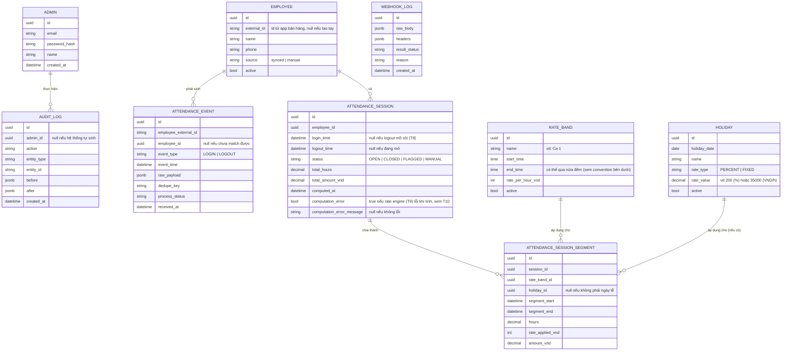

# ERD — Chấm Công data model (T1)

Implements the conceptual model from `PRD/PRD_ChamCong_TaskBreakdown.md` section 2
as the real schema in `backend/prisma/schema.prisma`. `audit_logs` and
`webhook_logs` are included per T1's Phạm vi even though the PRD's mermaid
diagram (reproduced below) only shows `audit_logs`.

## Rate band time convention (T4/T9 read this)

`rate_bands.start_time` / `end_time` are time-of-day only (Postgres `TIME`,
date component ignored). When `end_time <= start_time`, the band wraps past
midnight and ends at `end_time` on the next calendar day — e.g. `17:00–00:00`
covers 17:00 today through 24:00 (today), and `22:00–06:00` covers 22:00
today through 06:00 tomorrow. This lets a full-24h band set be expressed
without a `24:00` literal, which Postgres `TIME` cannot represent.

## Migrations

- `backend/prisma/migrations/<timestamp>_init/migration.sql` — the up
  migration, generated by Prisma from `schema.prisma`.
- `backend/prisma/migrations/<timestamp>_init/down.sql` — hand-written
  reverse of the same migration (Prisma does not generate down migrations).
  Apply with `npm run db:migrate:down --workspace=backend`; it also removes
  the migration's row from `_prisma_migrations` so `prisma migrate deploy`
  can cleanly re-apply it afterward.

## Seed data

`backend/prisma/seed.ts` (`npm run db:seed --workspace=backend`) is
idempotent — re-running it skips any record that already exists instead of
erroring. It creates: 1 default admin (email/password from
`SEED_ADMIN_EMAIL`/`SEED_ADMIN_PASSWORD`, or a random password logged once),
the 3 default rate bands (Ca 1/2/3, 23.000đ/h, covering 24h with no gap), 4
fixed-date holidays for the current year (1/1, 30/4, 1/5, 2/9), and 2 sample
manual employees.
